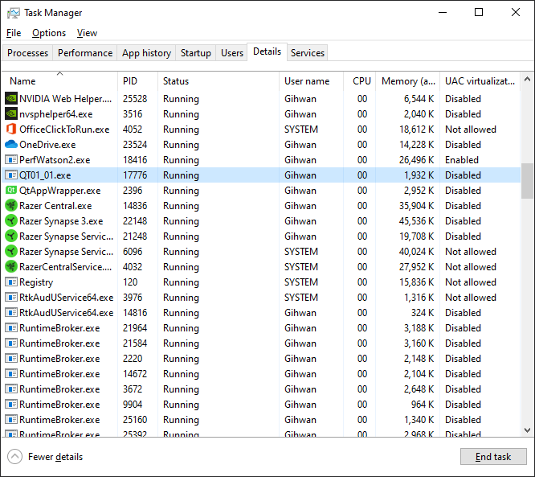

# Installation (설치)
Below describes a step-by-step process on how to install the Visual Studio 2017 and Qt5 libraries, including additional tool needed to compile the project.

> 본 내용은 Visual Studio 2017 및 Qt 라이브러리 그리고 컴파일에 필요한 도구 설치 과정을 단계적으로 설명한다.

### 1. Install Visual Studio 2017 (x84 or x64)
While Visual Studio 2019 (or above) is available, Qt5.14 Installer only supports MSVC2015-x64, MSVC2017-x84, and MSVC2017-x64. Future release may support up-to-date Visual Studio, but current Qt is the latest LTS version on February 17, 2020 KST. The Visual Studio 2017 can be downloaded [here](https://docs.microsoft.com/en-us/visualstudio/productinfo/2017-redistribution-vs#vs2017-download).

> Visual Studio 2019 (혹은 그 이상 버전)도 사용 가능하지만, Qt5.14 설치 프로그램에서는 MSVC2015-x64, MSVC2017-x84 그리고 MSVC2017-x64에서만 지원된다. 이후 Qt5 릴리즈는 최신 Visual Studio을 지원할 수 있겠지만, 현재 Qt5.14는 한국시간 2020년 2월 17일 기준으로 최신 LTS 버전이다. Visual Studio 2017 [다운로드](https://docs.microsoft.com/en-us/visualstudio/productinfo/2017-redistribution-vs#vs2017-download)는 여기에서 할 수 있다.

### 2. Download Qt Online/Offline Installer
Qt is a GUI framework provided by The Qt Company and it supports multiple platforms (e.g. Windows, macOS, Linux, and more). Qt can be installed in two methods: open-source and executable installer. For convenience, this tutorial installs Qt using the installer. You may download either [online](https://www.qt.io/download-qt-installer) or [offline](https://www.qt.io/offline-installers) installer.

> Qt는 The Qt Company에서 제공하는 멀티플랫폼(예. 윈도우, macOS, 리눅스 등) GUI 프레임워크이다. Qt는 두 가지의 방법으로 설치할 수 있으며, 오픈소스와 설치 프로그램이 있다. 편리를 위해 본 문서는 설치 프로그램을 사용한 설치 방법을 택하였다. [온라인](https://www.qt.io/download-qt-installer) 혹은 [오프라인](https://www.qt.io/offline-installers) 설치 프로그램을 다운로드 할 수 있다.

### 3. Install Qt Framework
Once download is finished, you may proceed to installation by executing the installer. You will be asked to create an account to install Qt on both online and offline installer as long as the computer is connected to the internet. Online installer would try to install all the available libraries for each compiler on *Select Components* section, so be sure to uncheck what is unnecessary but keep the MSVC2017 (32 bits or 64 bits, depending on the computer specification).

> 다운로드가 완료되었으면 설치 프로그램을 실행하여 설치를 진행한다. 인터넷에 접속되어 있는 한, 설치를 위해서 온리인과 오프라인 상관없이 Qt 계정을 만들어야 한다고 한다. 온라인 설치 프로그램은 각 종류의 컴파일러마다 필요한 라이브러리를 설치하려고 하므로, MSVC2017 (컴퓨터 사용에 따라 32비트 혹은 64비트)를 제외한 나머지는 선택해제한다.

### 4. Install Qt Visual Studio Tools
If you are thinking about using Qt Creator, you may stop here and just use the Qt Creator IDE instead. But the aim for this tutorial is to help intermediate-level developer how to design the GUI using C++ on Visual Studio only. The Qt Company provides additional tools available to install on official Visual Studio Marketplace ([here](https://marketplace.visualstudio.com/items?itemName=TheQtCompany.QtVisualStudioTools-19123)). Be sure to check you're downloading the tool for Visual Studio 2017.

> Qt Creator을 사용할 경우에는 해당 단계는 무시하고 바로 Qt Creator IDE를 사용하면 된다. 하지만 본 튜터리얼은 중급 개발자들이 Visual Studio만을 가지고 외부 라이브러리를 가져와 GUI를 설계하는 방법을 알려주는데 목표한다. The Qt Company에서는 공식 Visual Studio 마켓플레이스([클릭](https://marketplace.visualstudio.com/items?itemName=TheQtCompany.QtVisualStudioTools-19123))에서 Qt VS Tools이란 Qt 컴파일을 위한 도구를 제공한다. Visual Studio 2017 버전의 도구인지 확인하도록 한다.

# Setup (설정)
### 1. Initialize Qt VS Tools
After installation mentioned above is all done, open Visual Studio 2017 that now has additional tab called "Qt VS Tools". Currently no default component is selected to build the Qt with MSVC2017 compiler. Go to `Qt VS Tools > Qt Options > Add` and enter *Version name* however you like. If you installed the Qt5.14.1 on default location with offline installer, *Path* would be `C:\Qt\Qt5.14.1\5.14.1\msvc2017_64`. When finished, restart the Visual Studio 2017.

> 위에서 설명한 모든 설치 절차를 마쳤으면 Visual Studio 2017을 실행하여 "Qt VS Tools"이란 새로 생긴 탭을 클릭한다. 현재 MSVC2017 컴파일러로 Qt를 빌드하기 위한 구성요소 경로가 지정되지 않은 상태이다. `Qt VS Tools > Qt Options > Add`로 이동하여 *Version name*에는 원하는 이름을 입력한다. 오프라인 설치 프로그램으로 설치하였으면 구성요소 경로 *Path*는 기본적으로 `C:\Qt\Qt5.14.1\5.14.1\msvc2017_64`이다. 초기 설정을 마쳤으면 Visual Studio 2017을 재실행한다.

### 2. Create Qt Project
Now you are given an option to create a project as Qt application when clicking `File > New > Project...` under Visual C++ category. The *Qt GUI Application* is what you are looking for, but everything is already setup that you do not know how different this project is from the rest. Thus, we'll select *Qt Empty Application* that doesn't have anything at all.

> 재실행한 Visual Studio 2017에서는 이제 `File > New > Project...`에서 C++ 카테고리 아래에 Qt 어플리케이션 프로젝트를 생성할 수 있는 메뉴가 나타난다. 그 중에서 *Qt GUI Application*이 바로 여러분이 원하는 것이지만, 이미 모든 것이 설정된 상태이므로 기존의 프로젝트와 다른 점을 알 수가 없다. 그러므로 본 튜터리얼에서는 아무것도 없는 *Qt Empty Application* 프로젝트를 생성한다.

### 3. Project Properties
This is the most important part and here is what you need to select and change:

> 본 절차는 가장 중요한 절차이며, 프로젝트 설정에 아래 사항을 변경한다:

* `Configuration Properties > General > Windows SDK version`: it is possible the empty Qt project has this configured to 8.1 by default which is actually for Windows 8.1. I don't know why this happened, but change it to the latest version possible.

    > Qt 프로젝트 생성 시 Windows SDK 버전이 윈도우 8.1 전용인 8.1로 설정되어 있을 수 있다. 왜 이러한 문제가 발생하는 지 모르겠지만, 가장 최신 버전으로 변경한다.

* `Configuration Properties > Qt Project Settings > Qt Installation`: you will see the familiar name you named at `Qt VS Tools > Qt Options`. That would be the Qt installation components you need to call to build the Qt project.

    > `Qt VS Tools > Qt Options`에서 설정한 버전 이름을 찾을 수 있다. 해당 버전 이름을 클릭하여 Qt 프로젝트 빌드 시 필요한 구성요소를 지정된 경로로부터 불러온다. 

* `Configuration Properties > Qt Project Settings > Qt Modules`: from the called installation components, you can select which modules to use and not. The most crucial three modules that should be selected are **core**, **gui**, and **widgets**.

    > 불러온 구성요소에서 어떠한 모듈을 사용할 것인지 선택한다. 가장 핵심적인 세 가지의 모듈은 **core**, **gui**, 그리고 **widgets**이다.

You can now include Qt library and try out the C++ project from the scratch. 

> 설치가 완료되었으면 Qt 라이브러리를 불러와 C++ 프로젝트를 만들어 볼 수 있다.

# **Tutorial** (튜터리얼)

After the installation of Visual Studio 2017 and Qt5 is complete, you can actually run the solution and observe how application software works. For better understanding, each chapter provides detail explanation on how the code works.

> Visual Studio 2017과 Qt5 설치를 마친 이후, 해당 리포지터리의 솔루션을 직접 실행하여 어플리케이션 소프트웨어가 어떻게 동작하는지 확인할 수 있다. 더 쉬운 이해를 위해, 본 문서는 각 솔루션마다 상세 설명을 제공한다.

##  Chapter 1: Designing Application

This chapter describes on fundamental concept behind how Qt application works.

> 본 챕터는 Qt 어플리케이션 동작의 기본적인 개념에 대하여 설명한다.

### QT01_01.sln

While the script may seems not working, it is actually running the software application but without any graphical user interface. Since no GUI is presented to close the window, the only way to end the program is by ending the process named QT01_01.exe using Task Manager (shortcut: `Ctrl+Alt+Del`).

> 정작 스크립트가 동작하지 않은 것처럼 보이지만, GUI가 없이 어플리케이션 소프트웨어는 실행되고 있다. 창을 닫기 위한 GUI가 없기 때문에, 프로그램을 종료하는 방법은 작업 관리자 (단축키: `Ctrl+Alt+Del`)에서 QT01_01.exe 프로세스를 직접 종료하는 방법이 유일하다.

### QT01_02.sln

The software application now has `QMainWindow` presented as the main GUI window. Closing the window stops the script.

> 본 어플리케이션은 `QMainWindow`를 GUI 메인 창으로 사용한다. 창을 닫으므로써 스크립트를 종료할 수 있다.

### QT01_03.sln

The software application can have the widget as the main GUI window instead. In this chapter, `QLabel` widget, a GUI component responsible for showing text label, is used with "Hello World!" text written.

> 어플리케이션 소프트웨어는 위젯을 GUI 메인 창으로 대신 활용할 수 있다. 본 스크립트에서는 `QLabel`이란 텍스트 레이블을 표시하는 GUI 구성요소를 사용하였으며 "Hello World!"가 적힌 것을 볼 수 있다.

This is where the difference between widget and window matters the most. Widget is a GUI component that has interactable features (such as button, scroll bar, edit line) as s child of a window. However, the widget without a parent, that is a widget that is not a child of any becomes a window.

> 여기서 위젯(widget)과 창(window)의 차이점이 중요하게 여겨진다. 위젯은 창의 자식(child)으로 상호작용 가능한 GUI 구성요소(예를 들어 버튼, 스크롤바, 입력란)이다. 하지만 부모가 없는 위젯, 즉 어떠한 자식이 아닌 위젯은 창이 된다.

### QT01_04.sln

The software application sets `QLabel` as a central widget of the `QMainWindow`. 

> 어플리케이션 소프트웨어에서 `QLabel`을 `QMainWindow`의 중앙 위젯(central widget)으로 설정하였다.

Window is divided into five different sectors: menu, toolbar, status bar, dock widgets, and central widget. Widget to be shown as a main on a window should be placed on the central widget.

> 창은 다섯 가지의 구역으로 나뉘어진다: 메뉴, 툴바, 상태바, 도크 위젯, 그리고 중앙 위젯이다. 창에서 주요로 보여질 위젯은 중앙 위젯에 놓여야 한다.

### QT01_05.sln

The software application creates empty widget `QWidget` as the central widget and installed vertical layout for child widgets placement. Two `QLabel` are placed vertically by the layout.

> 어플리케이션 소프트웨어은 빈 위젯 `QWidget`을 중앙 위젯으로 사용하고 자식 위젯을 놓을 수 있도록 수직 레이아웃을 삽입하였다. 두 개의 `QLabel`이 레이아웃에 의해 수직으로 배열되었다.

Layout is essential object to place widgets and another layouts in a desired location and shape.

> 레이아웃은 위젯이나 다른 레이아웃을 원하는 위치나 형태로 배치시키기 위해 반드시 필요한 객체이다.

### QT01_06.sln

The solution results exactly the same as the *QT01_05.sln* but is programmed in object-oriented.

> 솔루션은 *QT01_05.sln*과 동일한 결과를 보여주지만 객체 지향 프로그래밍으로 코딩되었다.

Custom class `MainWindow` is created using `QMainWindow` as a base class. Thus, `MainWindow` class inherits most of the attributes (that is, public and protected members) but also bears its own feature, such as having two `QLabel` as child widgets.

> 자체제작 클래스 `MainWindow`는 `QMainWindow`를 기반 클래스로 생성되었다. 그러므로 `MainWindow` 클래스는 대부분의 속성을 상속받았으며 (public 및 protected 맴버에 한함), 또한 두 개의 `QLabel`을 자식 위젯을 가지는 특유의 성질을 가진다.