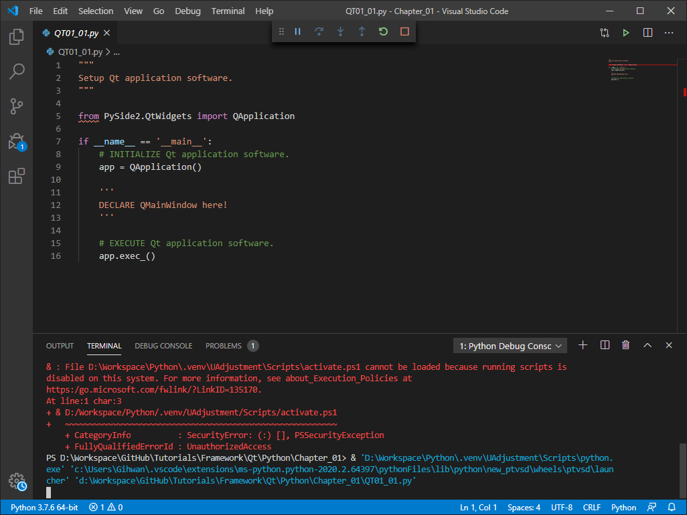
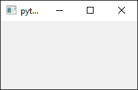
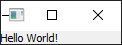
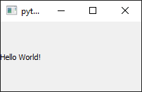

# **Installation** (설치)

Below describes a step-by-step process on how to install Python3 and the Qt for Python library, also known as PySide2.

> 본 내용은 파이썬 및 파이썬 전용 Qt 라이브러리, 즉 PySide2 설치 과정을 단계적으로 설명한다.

### 1. Install Python3
Download and install Python3 (3.7.x-64 bits recommended) [here](https://www.python.org/downloads/).

> 파이썬3 (3.7.x-64비트)를 다운로드 및 설치한다 ([클릭](https://www.python.org/downloads/)).

### 2. [Optional] Create Virtual Environment
On the command prompt window, enter the command below.

> 명령 프롬프트를 열어 아래의 명령어를 입력한다.

```
python -m venv <directory>\.venv
```
where `<directory>` is where you want to store the virtual environment. The environment does not have to be right next to currently working project, and can be placed anywhere.

> 여기에서 `<directory>`는 가상환경을 저장할 경로를 의미한다. 가상환경은 현재 작업하는 파이썬 프로젝트 경로에 있을 필요가 없으며 아무 위치에 놓여도 무관하다.

 Access the virtual environment through command prompt by entering

> 가상환경을 명령 프롬프트에서 접근하기 위해서는 아래의 명령어를 입력한다.

```
<directory>\.venv\Scripts\activate.bat
```
This will take you to the virtual environment with initial Python setup same as the one you installed on the system without any modules and packages. You can either deactivate by typing

> 이는 가상환경으로 생성된 파이썬에 접속하게 하며, 내부에는 파이썬을 처음 설치한 듯 어떠한 모듈이나 패키지가 설치되어 있지 않다. 명령 프롬프트에서 가상환경에 나기기 위해서는

```
deactivate
```
or just close the window.

> 혹은 명령 프롬프트를 종료해도 된다.

### 3. Install Qt for Python
Install the PySide2 using the pip

> PySide2를 pip를 통해 설치한다.

```
python -m pip install PySide2
```
The PySide2 is the Qt for Python developed by The Qt Company, while PyQt5 is developed by the different company called Riverbank. Both work almost identical, just the licenses difference.

> PySide2는 The Qt Company에서 개발한 파이썬 버전의 Qt이다. 한편 PyQt5도 존재하며, 이는 Riverbank라는 타회사에서 개발한 동일한 Qt 프레임워크이다. 두 프레임워크는 거의 동일하지만 라이선스 차이가 존재한다.

You can now import PySide2 package and try out the Python scripts in this tutorial repository.

> 설치가 완료되었으면 PySide2를 불러와 해당 리포지터리의 파이썬 튜터리얼 스크립트를 실행할 수 있다.


# **Tutorial** (튜터리얼)

After the installation of Python and PySide2 (i.e. Qt for Python) is complete, you can actually run the Python script and observe how application software works. For better understanding, each chapter provides detail explanation on how the code works.

> 파이썬과 PySide2 설치를 마친 이후, 해당 리포지터리의 스크립트를 직접 실행하여 어플리케이션 소프트웨어가 어떻게 동작하는지 확인할 수 있다. 더 쉬운 이해를 위해, 본 문서는 각 스크립트마다 상세 설명을 제공한다.

## Chapter 1: Designing Application

This chapter describes on fundamental concept behind how Qt application works.

> 본 챕터는 Qt 어플리케이션 동작의 기본적인 개념에 대하여 설명한다.

### QT01_01.py

While the script may seems not working, it is actually running the software application but without any graphical user interface. Since no GUI is presented to close the window, the only way to end the program is stop running the script.

> 정작 스크립트가 동작하지 않은 것처럼 보이지만, GUI가 없이 어플리케이션 소프트웨어는 실행되고 있다. 창을 닫기 위한 GUI가 없기 때문에, 프로그램을 종료하는 방법은 스크립트를 종료하는 방법이 유일하다.



### QT01_02.py

The software application now has `QMainWindow` presented as the main GUI window. Closing the window stops the script.

> 본 어플리케이션은 `QMainWindow`를 GUI 메인 창으로 사용한다. 창을 닫으므로써 스크립트를 종료할 수 있다.



### QT01_03.py

The software application can have the widget as the main GUI window instead. In this chapter, `QLabel` widget, a GUI component responsible for showing text label, is used with "Hello World!" text written.

> 어플리케이션 소프트웨어는 위젯을 GUI 메인 창으로 대신 활용할 수 있다. 본 스크립트에서는 `QLabel`이란 텍스트 레이블을 표시하는 GUI 구성요소를 사용하였으며 "Hello World!"가 적힌 것을 볼 수 있다.



This is where the difference between widget and window matters the most. Widget is a GUI component that has interactable features (such as button, scroll bar, edit line) as s child of a window. However, the widget without a parent, that is a widget that is not a child of any becomes a window.

> 여기서 위젯(widget)과 창(window)의 차이점이 중요하게 여겨진다. 위젯은 창의 자식(child)으로 상호작용 가능한 GUI 구성요소(예를 들어 버튼, 스크롤바, 입력란)이다. 하지만 부모가 없는 위젯, 즉 어떠한 자식이 아닌 위젯은 창이 된다.

### QT01_04.py

The software application sets `QLabel` as a central widget of the `QMainWindow`. 

> 어플리케이션 소프트웨어에서 `QLabel`을 `QMainWindow`의 중앙 위젯(central widget)으로 설정하였다.



Window is divided into five different sectors: menu, toolbar, status bar, dock widgets, and central widget. Widget to be shown as a main on a window should be placed on the central widget.

> 창은 다섯 가지의 구역으로 나뉘어진다: 메뉴, 툴바, 상태바, 도크 위젯, 그리고 중앙 위젯이다. 창에서 주요로 보여질 위젯은 중앙 위젯에 놓여야 한다.

###  QT01_05.py

The software application creates empty widget `QWidget` as the central widget and installed vertical layout for child widgets placement. Two `QLabel` are placed vertically by the layout.

> 어플리케이션 소프트웨어은 빈 위젯 `QWidget`을 중앙 위젯으로 사용하고 자식 위젯을 놓을 수 있도록 수직 레이아웃을 삽입하였다. 두 개의 `QLabel`이 레이아웃에 의해 수직으로 배열되었다.


Layout is essential object to place widgets and another layouts in a desired location and shape.

> 레이아웃은 위젯이나 다른 레이아웃을 원하는 위치나 형태로 배치시키기 위해 반드시 필요한 객체이다.

### QT01_06.py

The solution results exactly the same as the *QT01_05.sln* but is programmed in object-oriented.

> 솔루션은 *QT01_05.sln*과 동일한 결과를 보여주지만 객체 지향 프로그래밍으로 코딩되었다.


Custom class `MainWindow` is created using `QMainWindow` as a base class. Thus, `MainWindow` class inherits most of the attributes but also bears its own feature, such as having two `QLabel` as child widgets.

> 자체제작 클래스 `MainWindow`는 `QMainWindow`를 기반 클래스로 생성되었다. 그러므로 `MainWindow` 클래스는 대부분의 속성을 상속받았으며, 또한 두 개의 `QLabel`을 자식 위젯을 가지는 특유의 성질을 가진다.